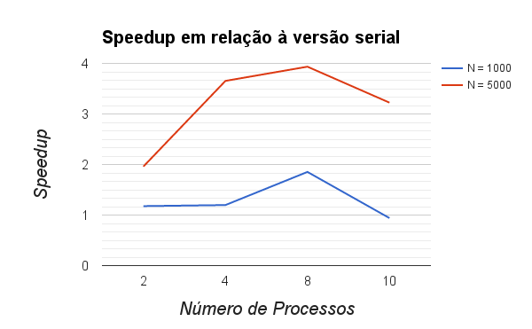
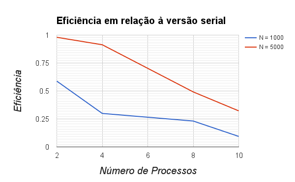
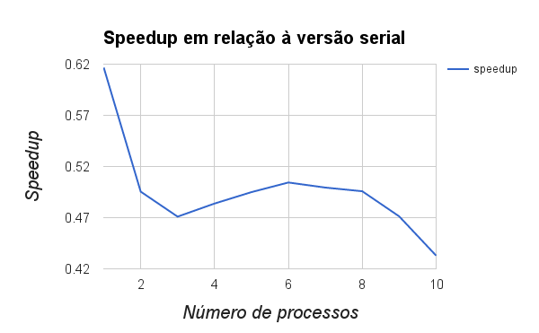

% Computação de Alto Desempenho - Trabalho Prático 3
% Alunos: Bernardo Amorim & Marcos Seefelder; Professor: José Camata; Engenharia de Computação e Informação - UFRJ
% 25/07/2016

--- 
fontsize: 11pt
papersize: A4
geometry: margin=2cm 
---

# Exercício 1

Código fonte disponível no diretório *ex01* do arquivo anexo junto ao relatório.

**Compilação**: `mpicc -o hello main.c`
 
**Execução**: `mpirun -np <numero de processos> ./hello`

# Exercício 2

Código fonte disponível no diretório *ex02* do arquivo anexo junto ao relatório.

## Troca de mensagens bloqueante

**Compilação**: `mpicc -o helloBsend helloBsend.c`
 
**Execução**: `mpirun -np <numero de processos> ./helloBsend`

**Observação**: Foi necessário incluir uma checagem de paridade no número de processos, pois caso o número fosse ímpar, um processo sobrava na atribuição de pares e causava *deadlock* na execução, como era de se esperar.

## Troca de mensagens não-bloqueante

**Compilação**: `mpicc -o helloNBsend helloNBsend.c`
 
**Execução**: `mpirun -np <numero de processos> ./helloNBsend`

**Observação**: Na linha 57 (`MPI_Waitall(2, req, stat);`) está a subrotina que bloqueia o processo até que tanto seu envio quanto seu recebimento tenham sido concluídos, caso contrário o processo pode terminar antes de receber o id do parceiro (com um resultado errado).

# Exercício 3

Código fonte disponível no diretório *ex03* do arquivo anexo junto ao relatório.

**Compilação**: `mpicc -o ring ring.c`
 
**Execução**: `mpirun -np <numero de processos> ./ring`

# Exercício 4

Código fonte disponível no diretório *ex04* do arquivo anexo junto ao relatório.

**Compilação**: `mpicc -o ringSum ringSum.c`
 
**Execução**: `mpirun -np <numero de processos> ./ringSum`

# Exercício 5

Código fonte disponível no diretório *ex05* do arquivo anexo junto ao relatório.

Para a implementação da multiplicação de matrizes (A e B), fizemos um *broadcast* da matriz B para todos os processos e fizemos um *scatter* da matriz A entre os processos. Consideramos que B era transposta, para simplificar o acesso à memória (acessamos tudo por linhas). Dessa maneira, cada processo resolve a multiplicação para um conjunto de linhas da matriz e no final é feito um *gather* para agregar a matriz de resultado no processo de *rank* 0.

### Compilando

`mpicc -o matrix matrix.c`

### Executando

`mpirun -np <numero de processos> ./matrix <valor de N>`

## Resultados

\

*Speedup da implementação de `matrix.c` (versão paralela com MPI) em relação à de `matrix-serial.c` (versão serial)*

\

*Eficiência da implementação de `matrix.c` (versão paralela com MPI) em relação à de `matrix-serial.c` (versão serial)*

## Análise

Percebe-se uma melhora clara da versão paralela em relação à sequencial. Além disso, a execução com 4 processos é a que melhor relaciona eficiência e *speedup*, uma vez que oferece um *speedup* de quase 4 vezes com quase 100% de eficiência.

# Exercício 6

Código fonte disponível no diretório *ex06* do arquivo anexo junto ao relatório.

Para dividir o produto interno entre os processos, fizemos um *scatter* dos vetores, calculamos os produtos internos separadamente e fazemos uma redução dos valores obtidos no processo de *rank* 0, tendo assim o produto interno do vetor inteiro.

### Compilando

`mpicc -o innerProduct innerProduct.c`

### Executando

`mpirun -np <numero de processos> ./innerProduct`

## Resultados

Nossos testes foram realizados em vetores de `277200000` elementos (próximo de 1 Gigabyte).

\

*Speedup da implementação de `innerProduct.c` (versão paralela com MPI) em relação à de `innerProduct-serial.c` (versão serial)*

## Análise

Percebe-se que houve uma perda de velocidade do código paralelo em relação ao em série. Acreditamos que o *overhead* de comunicação entre os processos criado pelo uso da MPI não compensa no caso dessa aplicação que faz operações simples. É possível que aumentado o vetor, obtivéssemos alguma melhora do paralelo em relação ao sequencial, mas para vetores muito grandes, a memória passa a ser o problema.

# Exercício 7

Código fonte disponível no diretório *ex07* do arquivo anexo junto ao relatório.

## Versão replicada com MPI

O arquivo `game_of_life-mpi-replica.c` apresenta a versão serial do código de `game_of_life-serial.c` replicada em processos MPI. Isso foi feito apenas incluindo `mpi.h`, inicializando o contexto MPI no início da `main()` e finalizando o mesmo no final da `main()`.

### Compilando

`mpicc -o conway-replica game_of_life-mpi-replica.c`

### Executando

`mpirun -np <numero de processos> ./conway-replica`

## Versão paralela com MPI

O arquivo `game_of_life-mpi-parallel.c` apresenta a versão paralela do jogo da vida de conway. Partindo do código fonte disponível em `game_of_life-mpi-replica.c`: 

* Realizamos a decomposição do domínio por linhas: 
	* Tendo definidos um número de linhas e colunas NI e NJ, respectivamente, decobrimos o número `commSize` de processos e dividimos o número de linhas entre os processos, tendo `ni = (NI/commSize)+2`. O `+2` é referente às células fantasma no limite dos domínios que são recebidas dos processos vizinhos
	* Para garantir o funcionamento para qualquer valor de processos, fizemos com que o processo de maior rank (`taskId == commSize-1`) ficasse responsável pelas linhas que sobram da divisão, portanto: `ni = 2 + NI - ( (commSize - 1) * (NI / commSize) )`
	* Cabe ressaltar que o número de colunas é igual para todos os processos
* Cada processo envia ao seu **processo anterior**(`taskId-1`, representado como `downProc`) sua **primeira linha** e recebe do mesmo a última linha, que passa a ocupar a linha fantasma no início do seu subdomínio. O análogo é feito em relação ao **próximo processo**(`taskId+1`, representado como `upProc`) e a **última linha**
	* Vale ressaltar que o devido tratamento foi feito para que o processo de `taskId == 0` apontasse seu `downProc` para o último processo (`commSize - 1`) e para que esse último processo apontasse seu `upProc` para o processo 0
* Os **envios são feitos de forma não-bloqueante**, e após os mesmos, são tratadas todas as células do subdomíno que não dependem das células a serem recebidas dos vizinhos. Quando esse tratamento é concluído, temos um `MPI_Waitall(4, req, stat)` que espera até que todos os envios e recebimentos do processo tenham sido concluídos para enfim tratar as células nas bordas de linha dos processos
* Ao final de todas as iterações, cada processo conta quantas células vivas possui e é feito então um `MPI_Reduce(&isum, &globalsum, 1, MPI_INT, MPI_SUM, 0, MPI_COMM_WORLD)`, que reduz as somas locais (`isum`) em uma soma global (`globalsum`) no processo de rank (`taskId`) 0. Esse processo, por sua vez, imprime esse valor.

### Compilando

`mpicc -o conway-parallel game_of_life-mpi-parallel.c`

### Executando

`mpirun -np <numero de processos> ./conway-parallel`

### Observação:

Como era de se esperar, o número de células vivas no final do caso paralelo não é o mesmo que no caso serial uma vez que o domínio é preenchido com a função `rand()` de **C**, o que no código serial acontece em um só processo, acontece igual em cada processo do MPI (portanto o domínio da versão paralela fica diferente daquele da versão serial). Uma observação que pode ser feita é que no código original fornecido com a especificação do trabalho (`game_of_life-serial.c`), não é fornecida nenhuma *seed* para a geração de números aleatórios, portanto a sequência gerada é sempre a mesma. Continuamos seguindo isso nas duas implementações posteriores, o que nos permitiu verificar o bom funcionamento do código, pois uma versão específica do código tem que terminar sempre com o mesmo número de células vivas.

Tomamos a liberdade de gerar os subdomínios independentemente em cada processo pois o propósito é que o domínio fosse aleatório e focamos na solução da paralelização da execução das iterações.